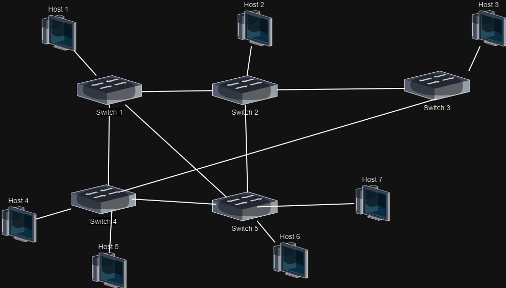
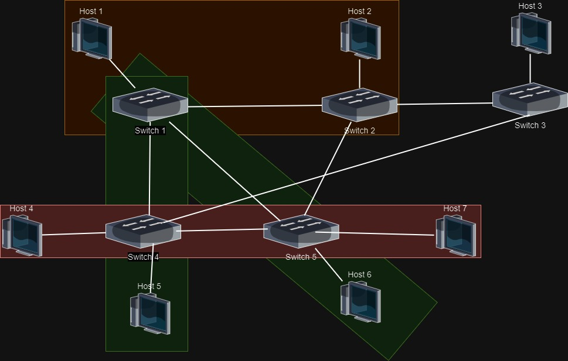
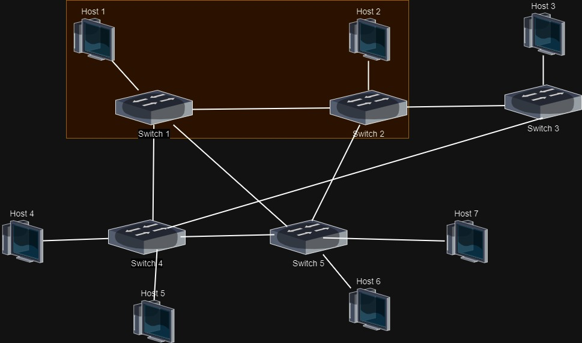
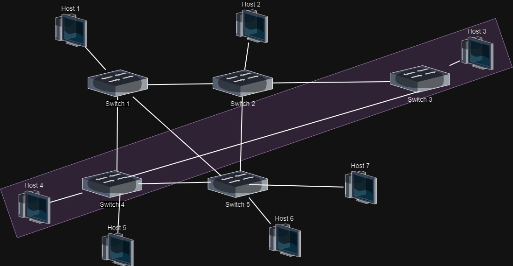

# SDN Network Slicing

<div>
        
        
</div>

## Table of contents

- [Introduction](#introduction)
- [Scenario 1 - Default](#scenario-1---default)
- [Scenario 2 - Lower](#scenario-2---Lower)
- [Scenario 3 - Upper](#scenario-1---Upper)
- [Scenario 4 - Total](#scenario-1---Other)
- [Setup the virtual machine](#Setup-the-virtual-machine)
- [Run the demo](#Run-the-demo)
- [Other resources](#Other-resources)


# Introduction

The goal of this project is to develop a method for network slicing that allows for flexible activation and deactivation of network slices through either a command line interface (CLI) launching bash scripts. To achieve this, 4 different scenarios have been proposed, all using the same network structure.


The network is composed of 5 switches and 8 hosts, with the following topology:



# Scenario 1 - Default

 

# Scenario 2 - Lower

 

# Scenario 3 - Upper

 

# Scenario 4 - Other

 


# Setup the virtual machine

1. follow the instruction here to install mininet on a virtual machine: https://www.granelli-lab.org/researches/relevant-projects/comnetsemu-labs
2. Clone the repository in the virtual machine:
```bash
git clone


# Run the demo


To run this demo, follow these steps:


# Other resources
