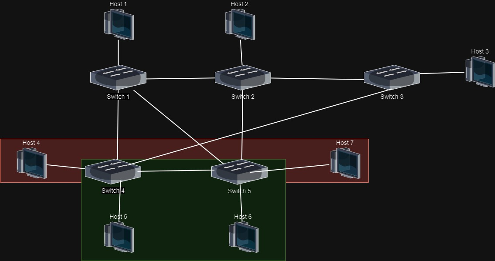

# SDN Network Slicing

<div>
        
        
</div>

## Table of contents

- [Introduction](#introduction)
- [Scenario 1 - Default](#scenario-1---default)
- [Scenario 2 - Lower](#scenario-2---Lower)
- [Scenario 3 - Upper](#scenario-1---Upper)
- [Scenario 4 - Other](#scenario-1---Other)
- [Setup the virtual machine](#Setup-the-virtual-machine)
- [Run the demo](#Run-the-demo)
- [Other resources](#Other-resources)


# Introduction

The goal of this project is to develop a method for network slicing that allows for flexible activation and deactivation of network slices through either a command line interface (CLI) launching bash scripts. To achieve this, 4 different scenarios have been proposed, all using the same network structure.


The network is composed of 5 switches and 7 hosts, with the following topology:


# Scenario 1 - Default
Orange = 8Mbps, Red = 2Mbps, Green = 4Mbps

 


# Scenario 2 - Lower
Red = 2Mbps, Green = 4Mbps

 


# Scenario 3 - Upper
Orange = 8Mbps

 


# Scenario 4 - Other
Purple= 10Mbps

 


# Setup the virtual machine

1. follow the instruction here to install mininet on a virtual machine: https://www.granelli-lab.org/researches/relevant-projects/comnetsemu-labs
2. Clone the repository in the virtual machine:
```bash
git clone https://github.com/Federico467/Networking_2_Project
```


# Run the demo


To run this demo, follow these steps:

1. go to the Networking_2_Project folder and start first the controller and then the network:
```bash
cd Networking_2_Project
ryu-manager controllerSlicing.py
sudo python3 Network.py
```
2. Open a new terminal and go to the Networking_2_Project/scripts folder:
```bash
cd Networking_2_Project/scripts
```
3. Now you can run the bash scripts to activate and deactivate the network slices. For example, to activate the default scenario run:
```bash
./Default.sh
```
4. To deactivate the network slices run:
```bash
./reset.sh
```


# Other resources

https://github.com/luiss07/Topology-DynamicSlicing/tree/main
